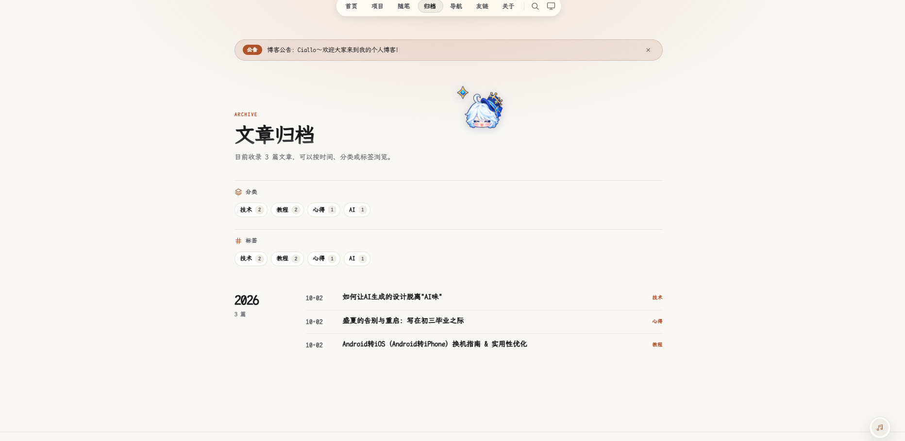
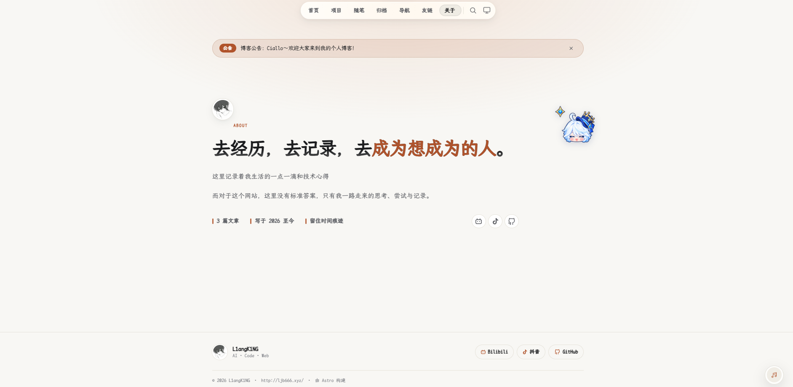
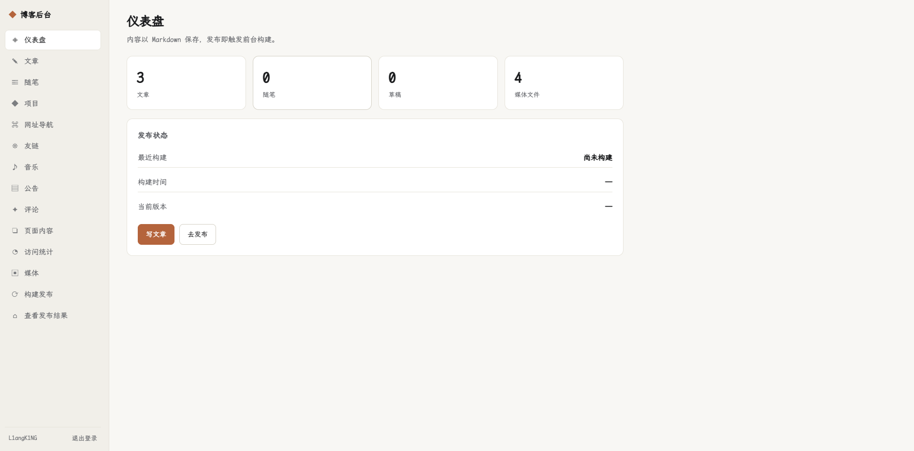

# L1angK1NG_Website

<p align="center">
  
  
  
  
</p>

<p align="center"><b>前台首页</b></p>

<p align="center"></p>

<p align="center"><b>后台仪表盘</b></p>

<p align="center"></p>

<p align="center"><b>文章归档</b></p>

<p align="center"></p>

<p align="center"><b>关于页</b></p>

<p align="center"></p>

个人全栈博客：**静态前台 + 后台管理**。前台是纯静态构建产物，后台是一个小型 Node 管理服务，负责登录鉴权、在线编辑 Markdown，并在发布时触发一次前台构建、原子切换上线。
> **基于原作者项目开发**：本项目在 [laogou717/clay-blog](https://github.com/laogou717/clay-blog)（MIT 协议）的基础上改造而成——保留其 Astro 静态博客的全部前台能力（文章、随笔、归档、分类、标签、搜索、RSS、sitemap、Twikoo 评论、音乐播放器），新增后台管理端与「构建即发布」的全栈能力。感谢原作者的开源工作。

## 更新日志

### V2.0.0

- **新增**：后台仪表盘全新改版——「博客访问 / 文章数据 / 服务器监控」三大模块一站看全：今日、昨日、近 7 天、近 30 天的访问与访客（含环比箭头），平滑曲线访问趋势图（悬停出现跟随光标的浮窗，显示日期、访问量、访客量），访问来源与设备分布、热门页面与地域排行、文章与评论概况、服务器资源用量与异常警报，支持手动刷新和定时自动刷新
- **新增**：文章编辑器推倒重做——写作优先版式：大标题直接起笔、日期分类随行排布，工具栏一键加粗/斜体/引用/列表，字数与预计阅读时长实时统计，Ctrl+Z / Ctrl+Y 多级撤销重做，「文章设置」常驻右侧随手可改而不打扰写作
- **新增**：正文插图——「插图」面板可从媒体库选图或上传（JPG / PNG / WebP，单张 ≤ 10MB），选尺寸、对齐、写图注后插入；图片直接拖进或粘贴到正文即插，支持一次多张批量插入；插图按原比例小号展示，不放大不变形，描述文字显示为图片下方的图注
- **新增**：统一的日期时间选择控件——文章发布日期、开站日期、公告生效/失效时间全部换成同一套自研日历+时分选择器（可精确到分钟，风格与后台一致）；删除的文章/随笔进入回收站，可一键恢复或彻底删除
- **体验**：文章阅读页排版升级——中文强调改用传统着重号（不再歪斜）、引用块与分隔线更雅致、代码块带语言标签、正文标题悬停出「#」直达链接、行内代码与键盘按键样式更清晰；访问趋势图动画全面重做，曲线光滑、悬浮窗渐显且全程不闪不跳
- **性能**：登录后进入后台几乎瞬开（仪表盘数据一次到位，服务器指标后台补全不阻塞显示）
- **修复**：编辑已有文章提示「页面加载失败（500）」；新建文章提示「signal is not defined」；趋势图「近 12 月」点击后空白；上传超限/格式不符的提示更明确

### V1.9.0

- **新增**：前台首页「网站数据」——网站运行时间、总文章量、总评论量、总访问量、今日访问量一排展示，数据实时更新；开站日期在后台「站点数据」页设定，加减按钮和日历选日期两种方式随你用
- **新增**：后台访问统计增加「近一个月」「近一年」两个时间口径（卡片数字 + 近一年每月访问图），今日/昨日/近 7 天的计算也修正为按自然日计，数字更准
- **修复**：访问统计「页面排行」里的中文地址不再显示成一串 %XX 编码，直接显示原始中文；同一页面新旧形式的记录自动合并计数
- **体验**：后台登录 30 分钟免密——同一浏览器 30 分钟内反复访问不用重复输密码（登录时勾选「记住登录状态」，默认开启；退出登录立即失效，后台服务重启也不受影响）
- **整理**：后台侧边栏按用途分组（内容 / 页面 / 互动 / 数据 / 发布）——访问统计并入「站点数据」，网址导航与友链合并为「导航 · 友链」，「页面内容」改名「页面文案」、「查看发布结果」改名「查看网站」，旧地址自动跳转不失效

### V1.8.0

- **性能**：网站打开明显提速，弱网和移动端更友好（图片与字体大幅瘦身）
- **体验**：报错提示更友好——接口异常不再刷屏报错，友链申请、评论、点赞失败都有明确提示和重试；搜索输入更跟手；空列表有提示；页面切换不再闪深浅色
- **稳定**：人多的时候评论、点赞、访问统计不再丢数据，访问高峰后台不卡顿
- **安全**：后台全面加固——弱密钥拒绝启动、上传文件校验更严、预览和评论杜绝恶意代码；数据备份默认不再携带敏感配置
- **修复**：网易云歌曲在前台播放提示「无法播放」——现在导入的歌曲、歌单里的歌曲都能正常播放，播放解析全部经服务端转发，不再受音乐解析服务对浏览器的限制
- **修复**：后台导入网易云歌单更顺畅（纯数字 ID 可直接导入、重复导入不报错）；音乐统一为单列表管理
- **新增**：音乐播放器歌词显示——播放时自动加载歌词、跟随进度高亮滚动，右上角可一键开关（偏好会记住）
- **体验**：后台深度优化——切换页面不再强制刷新、不再闪白（无刷新秒切），保存操作后原地刷新不打断；全新动效体系：页面切换与内容错峰入场、编辑面板弹出、按钮/卡片/表格微交互、提示条滑入滑出、顶部加载进度条、统计数字滚动、图片淡入；顺带修复后台字体失效与切换卡顿，稳定性增强（连点防抖、失败自动恢复）
- **体验**：自定义光标更跟手（跟随更贴鼠标，顺滑惯性不变）
- **修复**：多次刷新后文章评论、随笔留言看不了也发不了的问题——浏览、发送、点赞的额度从此分开计算，正常使用不会再误触限流；失败提示改为显示具体原因
- **新增**：CI 构建校验与代码规范检查，文档补齐（环境变量表、API 参考）
- **整理**：项目文件大扫除——删除根目录遗留素材源文件与无用文件，README 截图归入 `docs/assets/`，文档统一归 `docs/`，根目录只保留标准工程文件

### V1.7.0

- **新增**：开箱即用的默认页面骨架——克隆下来主页、关于页、页脚和公告都有默认内容可直接预览，替换成自己的文案即可开站

### V1.6.0

- **改进**：发布后的数据备份更省心——本地不再留下备份文件夹（备份完即清理），失败会自动在下次发布时重试；未配置备份仓库时自动跳过
- **清理**：示例配置与文档不再包含真实信息（一律占位）；音乐播放器未配置歌单时自动隐藏

### V1.5.0

- **新增**：发布成功后自动备份个人数据（文章、媒体、动态数据等）到 GitHub 私有仓库，也可手动触发备份
- **新增**：后台「构建发布」页可直接填写备份仓库地址，保存后下次发布生效

### V1.4.0

- **新增**：项目展示、网址导航、友链三个页面（后台均可管理；友链支持访客在线申请、后台一键审核）
- **新增**：音乐播放器支持上传本地音频和导入网易云歌曲/歌单，播放失败自动切下一首；后台可试听、上下架、排序
- **新增**：内置评论（开箱即用，无需第三方服务），支持回复与点赞，后台可管理
- **新增**：主页首屏、关于页、页脚文案均可在后台直接编辑
- **新增**：主题默认跟随系统深浅色；全站换用霞鹜文楷字体；顶部公告栏；后台访问统计（访问量、热门页面、访客分布）
- **改进**：导航新增项目/导航/友链入口，窄屏可横向滑动
- **修复**：自定义光标与部分按钮样式冲突；大标题字母下伸部分被裁剪；构建日志乱码

### V1.3.0

- **新增**：Q 版自定义光标——平滑跟随、悬停放大、按压反馈；触屏设备与「减少动效」设置下自动适配

### V1.2.0

- **修复**：主色按钮悬停时颜色变淡、几乎看不清的问题

### V1.1.0

- **新增**：登录失败在表单内直接提示原因与剩余次数，已输入内容不丢
- **新增**：媒体上传自动去重（相同文件只存一份）；删除仍被文章引用的文件会被拦截并指出引用位置
- **新增**：后台页面切换动画与前台一致
- **修复**：登录页错误提示初始误显示

### V1.0.0

- **新增**：后台管理系统——在线撰写/编辑文章与随笔（实时预览）、管理媒体、一键「构建发布」上线，支持草稿与版本回滚
- **修复**：保存含特殊字符标题的文章不再报错；删除文章后重新发布不再「复活」；本地可直接查看发布结果
- **清理**：移除原作者遗留素材，替换为本站品牌图；LICENSE 改为双署名

---

## 架构

```
互联网 → nginx (80/443)
           ├─ 所有前台页面 → 静态目录 current/（构建产物，原子切换）
           └─ /admin、/api、/admin-assets → 反代到管理服务（Node，端口 4000）
                                            ├─ 登录鉴权（session + CSRF）
                                            ├─ 写 src/content/*.md
                                            ├─ 上传图片 → public/uploads/
                                            └─ 触发构建 → astro build → 原子发布
```

- 内容仍以 Markdown 存放在 `src/content/`，前台的短代码、搜索、RSS、sitemap 全部照旧工作。
- 后台保存内容**只写文件**，不立即上线；到「构建发布」点一下才重新构建前台。
- 构建采用**原子切换**，构建失败不影响线上（旧版本继续服务）。

---

## 功能

**前台**
- 首页（精选 + 最新）、文章详情（目录侧栏、上一篇/下一篇、相关推荐、阅读时长）
- 归档（按年分组）、分类页、标签页、随笔时间线、客户端全文搜索
- SEO：RSS、sitemap、robots.txt、canonical、Open Graph、JSON-LD 结构化数据
- 明暗主题切换、路由过渡动画、选中文字引用评论、网易云音乐播放器
- 遗留短代码（``）兼容、图片属性注入

**后台（/admin）**
- 单管理员登录：scrypt 密码哈希 + session + CSRF 校验 + 登录失败限流
- 文章 / 随笔管理：列表、新建、编辑、删除、改路径（slug）
- Markdown 编辑器：写作 / 实时预览（预览复用前台短代码逻辑）
- frontmatter 表单化编辑，保存时保留未暴露字段（如 `ai`、`main_color`）
- 媒体库：图片上传到 `public/uploads/`，可插入正文 / 用作封面
- 构建发布：一键构建、构建日志、历史版本、**回滚上一版**
- 草稿支持：勾选「存为草稿」的内容不进前台

---

## 技术栈

| 部分 | 技术 |
| --- | --- |
| 前台 | Astro 7 + TypeScript（strict），零 UI 框架、零 CSS 框架 |
| 内容 | Markdown + YAML frontmatter，Astro Content Collections（Zod 校验） |
| 后台 | Node + Express + express-session，服务端渲染 HTML + 原生 JS |
| 鉴权 | Node crypto scrypt 密码哈希，session cookie（HttpOnly / SameSite=Strict） |
| 构建发布 | `astro build` → 原子切换软链接，构建锁防并发 |

---

## 快速开始

**环境要求：Node.js ≥ 20。** Astro 与后台依赖都在 `package.json` 里，`npm install` 自动装好。

```bash
# 1. 安装依赖
npm install

# 2. 前台：博客本地预览（改内容热更新）
npm run dev          # http://localhost:4321

# 3. 后台：管理服务（另开一个终端）
npm run admin        # http://localhost:4000/admin
```

本地开发时，后台保存内容后 `npm run dev` 自动热更新，可直接在前台看到效果。若要看最终静态产物：`npm run build && npm run preview`。

> 内容目录（`src/content/`）已清空，直接在后台（`/admin`）新建自己的文章与随笔即可。

---

## 后台使用

1. 登录后台 `/admin`。默认账号见 `.env` 的 `ADMIN_USER` / `ADMIN_PASSWORD_HASH`。
2. 「文章」→「新建文章」，填写标题、路径、分类标签、正文（Markdown，支持预览）。
3. 点「保存」——只写入文件。可勾选「存为草稿」，草稿不出现在前台。
4. 到「构建发布」→「构建并发布」，等待十几秒，前台即更新。
5. 若发布后发现问题，点「回滚上一版」。

> 本地有两种预览，别混淆：`npm run dev`（:4321）实时反映**保存的内容**，适合写作时预览；后台导航的「查看发布结果」打开的是**构建产物**（后台服务的根路径），与部署到服务器后的效果完全一致。删除内容后发布时，后台会自动重建构建缓存，此时若 dev 预览异常，重启一次 `npm run dev` 即可。

**修改管理员密码**

```bash
npm run admin:hash -- "你的新密码"
# 把输出的 ADMIN_PASSWORD_HASH=... 覆盖写入 .env，然后重启后台服务
```

---

## 内容与字段

- 文章：`src/content/posts/`
- 随笔：`src/content/notes/`
- 字段定义：`src/content.config.ts`

**文章 frontmatter**：`title`（必填）、`description`、`date`、`updated`、`cover`、`categories`、`tags`、`keywords`、`ai`、`sticky`（数字，越大越靠前）、`main_color`、`author`、`draft`（草稿）。

**随笔 frontmatter**：`date`（必填）、`title`、`mood`、`tags`、`draft`。

路径即 URL：`src/content/posts/技术/deploy-static.md` → `/posts/技术/deploy-static/`。后台「路径 / slug」可自定义，中文也可以；改路径会自动迁移文件。

---

## 项目结构

```
L1angK1NG_Website/
├── admin/                     # 后台管理服务
│   ├── server.mjs             # Express 入口（路由、鉴权、接口）
│   ├── views.mjs              # 页面模板
│   ├── lib/                   # auth / content / build / backup / store / routes 等
│   └── public/                # 后台样式与脚本
├── scripts/
│   ├── deploy.mjs             # 命令行构建发布（配合 cron / webhook）
│   ├── backup.mjs             # 手动触发数据备份（npm run backup）
│   ├── hash-password.mjs      # 生成管理员密码哈希
│   └── subset-font.mjs        # 字体子集化生成 woff2 分片（资源更新时运行）
├── public/                    # 静态资源（头像、封面、上传、字体分片）
├── src/
│   ├── components/            # 组件（导航、播放器、评论等）
│   ├── content/               # 文章与随笔（Markdown）
│   ├── data/                  # site.config.json、github-projects.json
│   ├── layouts/               # 页面布局
│   ├── lib/                   # 工具函数、共享净化/转义、Markdown 插件
│   ├── pages/                 # 路由页面
│   ├── scripts/               # 前台脚本（site/ 站点装配、音乐播放器、内联片段）
│   └── styles/                # 全局样式、字体分片声明、播放器样式
├── docs/                      # API 参考（API.md）与 README 截图（assets/）
├── DEPLOY.md                  # 服务器部署指南（nginx / systemd / 安全）
├── astro.config.mjs
└── package.json
```

后台全部 HTTP 接口的路径、方法、鉴权要求见 [docs/API.md](docs/API.md)。

---

## 环境变量

复制 `.env.example` 为 `.env`，按需填写（`.env` 已被忽略，请勿提交）：

```bash
SITE_URL=https://example.com          # 正式域名，用于 RSS / sitemap / canonical / 页脚

# 后台管理端
ADMIN_USER=你的用户名
ADMIN_PASSWORD_HASH=用 npm run admin:hash 生成
SESSION_SECRET=一串随机长字符串        # 生产必填：弱值/占位值会拒绝启动
ADMIN_PORT=4000
COOKIE_SECURE=true                    # 部署在 HTTPS 后面时设 true

# 前台功能
PUBLIC_TWIKOO_ENV_ID=                 # Twikoo 后端，留空则用内置评论
PUBLIC_NETEASE_PLAYLIST_ID=           # 网易云歌单 ID（纯数字）；留空则不显示音乐播放器
PUBLIC_MUSIC_API=https://meting.mikus.ink/api

# 数据备份（「构建发布」成功后自动执行；备份在系统临时目录完成、推送后即清理）
BACKUP_ENABLED=true                   # false 时发布后不做任何备份
BACKUP_REMOTE_URL=                    # 备份私库地址；留空则跳过备份
BACKUP_INCLUDE_ENV=false              # 是否连 .env 一起备份（含密钥，建议保持 false）
```

> 说明：`PUBLIC_NETEASE_PLAYLIST_ID` 为示例占位文本或非数字时按「未配置」处理（播放器隐藏、零请求）。`BACKUP_INCLUDE_ENV` 开启前请确认备份仓库严格私有——`.env` 含 `SESSION_SECRET` 与密码哈希。

---

## 构建与发布机制

- 「构建并发布」执行 `astro build`，成功后把 `dist/` 移入 `releases/<时间戳>/`，并把 `current` 软链接**原子**指向它。
- nginx 始终服务 `current/`，构建过程线上不受影响；构建失败则 `current` 保持原样。
- 默认保留最近 **5** 个发布版本，旧的自动清理，便于回滚。
- 也可用命令行发布（适合 cron / webhook）：`npm run deploy`。

**部署到服务器**（Node ≥ 20 + nginx）详见 [DEPLOY.md](DEPLOY.md)，含可直接复制的 nginx、systemd 配置与安全建议。

---

## 部署到你的博客

克隆后需要改的地方，集中在少数几个文件：

| 要改的内容 | 位置 |
| --- | --- |
| 站点名称 / 简介 / 作者 | `src/data/site.config.json` 的 `siteName` / `siteDescription` / `siteAuthor` |
| 头像 | 替换 `public/avatars/avatar.png` 与 `avatar-bw.png` |
| GitHub 用户名与仓库链接 | `src/data/site.config.json` 的 `githubUser` / `githubRepo`（导航「GitHub」按钮与关于页「开源项目」；不想要按钮就留空 `githubRepo`） |
| 正式域名 | `.env` 的 `SITE_URL` |
| 管理员账号 | `.env` 的 `ADMIN_USER` / `ADMIN_PASSWORD_HASH`（改密见上文） |
| 评论后端 | `.env` 的 `PUBLIC_TWIKOO_ENV_ID` |
| 音乐播放器歌单 | `.env` 的 `PUBLIC_NETEASE_PLAYLIST_ID` |
| 文章与随笔 | 后台直接增删改，或编辑 `src/content/` 下的 Markdown |
| 项目展示 | 后台「项目」模块维护（数据存 `data/projects.json`；属个人数据不入仓库，随数据备份进私库） |

> 提示：`site.config.json` 的 `githubUser` / `githubRepo` 当前为空，导航「GitHub」按钮与关于页「开源项目」暂不显示。填入你自己的 GitHub 用户名 / 仓库地址即可启用。

### 关于页自定义配置

关于页的「开源项目」与「资源下载」通过 `src/data/site.config.json` 配置：

- **开源项目**：构建时按 `githubUser` 从 GitHub API 拉取该账号的公开仓库（自动排除 fork、按 Star 排序），可用 `projectOverrides` 按仓库名覆盖图标 / 相关文章链接；API 不可达时回退到 `src/data/github-projects.json` 缓存，可用下面命令手动刷新：

  ```bash
  curl -s "https://api.github.com/users/<你的用户名>/repos?per_page=100" -o src/data/github-projects.json
  ```

- **资源下载 / 自定义项目组**：用 `projectGroups` 直接增删条目或整组，字段见 `src/data/site.config.json` 里的示例。

---

## 评论

评论前端未使用 Twikoo 默认 UI，而是通过 `src/lib/comments.js` 调用 Twikoo 后端接口并渲染自定义样式。配置 `.env` 的 `PUBLIC_TWIKOO_ENV_ID` 后即可启用；未配置时评论区与引用按钮自动隐藏。

文章正文支持**选中文字后引用到评论区**：拖选至少 2 个字符 → 点「引用评论」→ 自动滚动到底部评论框并以 Markdown 引用写入。

---

## 音乐播放器

右下角悬浮播放器按需读取网易云歌单，不自动播放。换歌单时从网易云歌单链接复制 `id` 数字写入 `.env` 的 `PUBLIC_NETEASE_PLAYLIST_ID`。Meting 为非官方接入，受版权 / VIP / 地区限制，个别歌曲可能无法播放；生产环境可将 `PUBLIC_MUSIC_API` 指向自建 Meting 兼容服务。

---

## 常见问题

**后台保存了，前台没变化？**
保存只写文件，需到「构建发布」点「构建并发布」才上线。

**构建失败怎么办？**
线上保持原版本不受影响。看「构建发布」的构建日志定位问题（多为 frontmatter 或 Markdown 语法），改好后再构建。

**忘记管理员密码？**
服务器上 `npm run admin:hash -- "新密码"`，写入 `.env` 后重启后台服务。

**没装过 Node.js？**
到 https://nodejs.org/ 下载 LTS 版本安装，npm 会一并装好，然后从「快速开始」继续。

**`npm install` 很慢 / 失败？**
国内可切镜像源：`npm config set registry https://registry.npmmirror.com`

**端口被占用？**
前台：`npm run dev -- --port 4322`；后台：改 `.env` 的 `ADMIN_PORT`。

---

## 许可证与致谢

本项目基于 [MIT License](LICENSE) 开源。

再次感谢原作者 [laogou717](https://github.com/laogou717) 的 [clay-blog](https://github.com/laogou717/clay-blog) 提供的 Astro 博客模板；本项目在其基础上新增后台管理与全栈发布能力。
